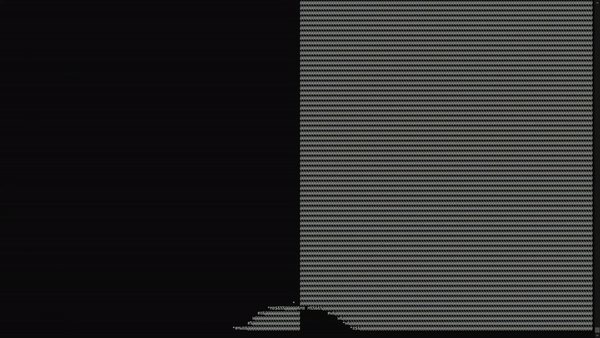
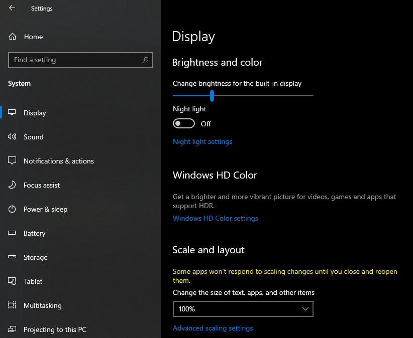

# Bad Apple in terminal using Python

When I was searching something to watch on YouTube, I find [THIS](https://www.youtube.com/watch?v=6zs6S_I5gH8)
video and want to try to do something just like that by myself "and of course with help of stackoverflow". 

[Link](https://youtu.be/ikyKLfB4cfg) to my video on YouTube.



## Getting Started

### Prerequisites

For this project you'll need these packages to install:
* opencv-python
* fpstimer
* playsound

### Installing packages

To install these packages write to console this code:

```
pip install opencv-python
```
```
pip install fpstimer
```
```
pip install playsound==1.2.2
```
or you can set your terminal to the directory of this repository and simply paste this:
```
pip install -r requirements.txt
```


## Size of window

The code is support any size of window, but if you want to run it full screen,
make sure that the size of text is set to 100%, or image will be asymmetric.
To check the size of text you need to go to settings > system > display > change the size of text. 


### Running this code

To run this code print in terminal:
```
python main.py
```

## Built With

* [Python 3.9.6](https://www.python.org/)
* [opencv-python](https://opencv.org/)
* [fpstimer](https://pypi.org/project/fpstimer/)
* [playsound](https://pypi.org/project/playsound/)


## Authors

* **Andrew Danylyshyn** - *Initial work* - [Koteikar](https://github.com/Koteikar)


## Acknowledgments

I'm extremely grateful to ZEN, for creating of Touhou.

I must also thank [あにら](https://www.nicovideo.jp/watch/sm8628149), for creating of video.
